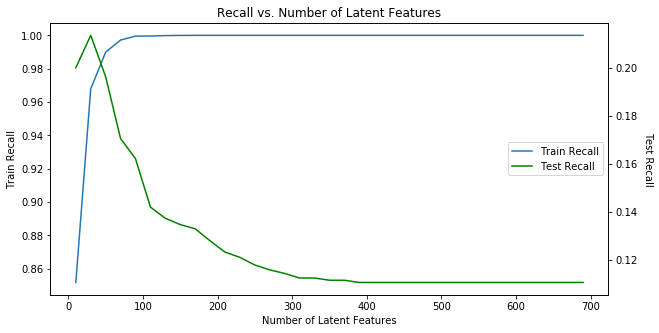

# Udacity Recommendations with IBM

## Nanodegree: Data Scientist

## Title: Recommendations with IBM

### Table of Contents

<li><a href="#project_motivation">Project Motivation</a></li>
<li><a href="#file_descriptions">File Descriptions</a></li>
<li><a href="#working_proccess">Working Proccess</a></li>
    <ul>
    <li><a href="#part_1">Part I : Exploratory Data Analysis</a></li>
    <li><a href="#part_2">Part II: Rank-Based Recommendations</a></li>
    <li><a href="#part_3">Part III: User-User Based Collaborative Filtering</a></li>
    <li><a href="#part_4">Part IV: Content Based Recommendations</a></li>
    <li><a href="#part_5">Part V: Matrix Factorization</a></li>
    </ul>

## Project Motivation

In this project we have analyzed the interactions that users have with articles on the IBM Watson Studio platform, and we have made recommendations to them about new articles we thought they would like. To do this we have used different approaches, like defining Machine Learning Pipelines with Natural Language Processing.

We have followed the structure of the notebook provided by Udacity, which includes some questions we need to answer and some cells with predefined code to check this answers.

## File Descriptions

* **Recommendations_with_IBM.html and Recommendations_with_IBM.ipynb:** Documentation with the work process.

* **user-item-interactions.csv:** CSV file with the interactions between the users and the articles. It is used to build the dataframe `df`:

    

* **articles_community.csv**: CSV file with the articles content. It is used to build the dataframe `df_content`:

 

* **pca_articles.pkl:** Dataframe with the 90 principal components obtained from the tfidf matrix. This information is saved into a file to make faster the content based recommendations.

* **user_item_matrix.p:** User-Item matrix obtained from the dataframe of interaction df.

* **project_tests.py, top_5.p, top_10.p and top_20.p:** Auxiliary files to check the answer to some questions maked by Udacity

## Working Proccess

### Part I : Exploratory Data Analysis

In this part is needed to answer the following questions:

1. What is the distribution of how many articles a user interacts with in the dataset? Provide a visual and descriptive statistics to assist with giving a look at the number of times each user interacts with an article.

2. Explore and remove duplicate articles from the `df_content` dataframe.

3. Find the next values:

    a. The number of unique articles that have an interaction with a user.
    b. The number of unique articles in the dataset (whether they have any interactions or not).
    c. The number of unique users in the dataset. (excluding null values)
    d. The number of user-article interactions in the dataset.

4. Find the answer to:

* 50% of individuals have _____ or fewer interactions.
* The total number of user-article interactions in the dataset is ______.
* The maximum number of user-article interactions by any 1 user is ______.
* The most viewed article in the dataset was viewed _____ times.
* The article_id of the most viewed article is ______.
* The number of unique articles that have at least 1 rating ______.
* The number of unique users in the dataset is ______.
* The number of unique articles on the IBM platform.
    

### Part II: Rank-Based Recommendations

This part is thought for the cases where we don't have information about the users because they are novels and they don't have interactions with the articles yet. So we recommend them the most popular articles. Since we don't have ratings for whether a user liked an article or not, we only know that a user has interacted with an article, the popularity of an article can really only be based on how often an article was interacted with.

We hafe defined function to return the id and the title of the 10 most popular articles.

### Part III: User-User Based Collaborative Filtering

We have defined a user-article interaction matrix:

* Each user only appears in each row once.
* Each article only shows up in one column.
* If a user has interacted with an article, then a 1 is placed where the user-row meets for that article-column. It does not matter how many times a user has interacted with the article, all entries where a user has interacted with an article should be a 1.
* If a user has not interacted with an item, then a zero is placed where the user-row meets for that article-column.

We have defined a function which takes a user_id and provide an ordered list of the most similar users to that user (from most similar to least similar). The returned result does not contain the provided user_id, as we know that each user is similar to him/herself. Because the results for each user here are binary, the similarity was computed as the dot product of two users.

Once we have the closest users, we have defined a function that loops through them and find articles the user hasn't seen before and provides them as recommendations. We stop when we reach a determined limit of articles. Users who are the same closeness are chosen arbitrarily as the 'next' user. For the user where the number of recommended articles starts below the limit and ends exceeding it, the last items are chosen arbitrarily.

We have also done another solution where:

* Instead of arbitrarily choosing when we obtain users who are all the same closeness to a given user, we have chosen the users that have the most total article interactions before choosing those with fewer article interactions.

* Instead of arbitrarily choosing articles from the user where the number of recommended articles starts below the limit and ends exceeding it, we have chosen articles with the the most total interactions before choosing those with fewer total interactions.

### Part IV: Content Based Recommendations

In this part we have developed a Content Based approach using the `doc_description` and `doc_full_name` contained in the dataframe `df_content` to extract the content of the article. We could have used the `doc_body` also, but we have considered that we could obtain a dictionary too long and the basic information is contained in the first two fields.

* Firstly we have defined a funtction to tokenize the string resulting of concatenate the title and the description. We have lemmatized also the text with WordNetLemmatizer and we have used the SnowballStemmer with English.
    
* We have defined also a function called ´tfidf_transformer´ that receives the data frame with the column of text we want to work with and the tokenize function we have defined before. It performs a vectorization and applies a tfidf transformation.
    It returns a dataframe with all the articles as rows, the dictionary obtained with the vectorization as columns and the tfidf data as values.
    
* There is an additional consideration that we have taken into account. Some articles appeared in the dataframe of interactions `df` but not in `df_content`. These articles are old items that the users had read, but they are no longer available now. If we only have used the `df_contet` dataframe to make the `tfidf_dataframe`, we could not have used their titles to make recommendations. To fix this problem we have added also those articles to the tfidf calculations.
    
* In the steps above, we have obtained a datagrame with 3388 columns. We have reduced the number of features. using Principal Component Analisys (PCA).
    
* Then we have defined a function called ´find_euclidean_distance´ that receives the id of an article and the tfidf dataframe obtained before and provides a dataframe with all the articles as rows and the distance as a column. The articles will be ordered from the closest to the farest to the article_id especified.
    

With the information obtained before we have defined a new function called `make_content_recs` that makes recommendations to a user following the next steps:

* Firsly, it checks if the user has read some article or not.
* If the user has not read any article we make a rank based recommendation with the ten articles with more readings. 
* If the user has read other articles we use the principal component matrix of the contents to find the more similar articles to each one.
* We divide the pca matrix obtained before in two groups. One with those articles that has had some readings and those with no readings at all. In the first group we select the 7 articles more similar to each one readed by the user. We present the result ordered by the number of readings. We have considered that the second group don't has any reading because they are new, although we don't have its date and this is not probably true. Most of them are likely articles that were not so interesting, but we have analysed them as novel content anyway. In a real situation would have the date of the articles and we will be able to separate them propperly. We have selected also the 3 articles more similar from this group and we have shown them as an additional recommendation to give them some chance in the case that they were new articles.

The result is a printout similar to this:

    Because you have read:

    Use xgboost, scikit-learn & ibm watson machine learning apis

    You may like:

    Python machine learning: scikit-learn tutorial
    The machine learning database
    A dynamic duo – inside machine learning – medium
    Top 10 machine learning use cases: part 1
    Ensemble learning to improve machine learning results
    Apple, ibm add machine learning to partnership with watson-core ml coupling
    Ml algorithm != learning machine

    Other articles you may like:

    From machine learning to learning machine (dinesh nirmal)
    Gaze into my reddit crystal ball – ibm watson data lab – medium
    On the passage of hb2 in north carolina
    
    

### Part V: Matrix Factorization

In this part we have used matrix factorization to make article recommendations to the users. We don't have any rating, we only know if an user has interacted with an article or not. This can supose an advantge in the sense that we can use the built in `SVD` method because we don't have null values, we don't need to apply the `FunkSVD` method. 

We started with an user_item matrix: a dataframe with the user_id as rows and the article_id as columns.Then we have applied Singular Value Decomposition to perform a matrix factorization **(A=UΣVT)**.

We had to decide the number of latent features. To do this we have followed the next procedure:

* We have splitted our original dataframe into a training set and test set of data. The data set was orderd by user in such a way that we can assign the higher `user_ids` (the most recent) to the test set. In this way we use the older data to the training  and the newest to the test, this is to avoid to make predictions about the past.
* we have obtained two user_item matrices for the train and test datasets.
* Then we had performed the `SVD` factorization on the train `user_item_train` matrix with different number of features and we have used these features to make predictions on the train and on the test dataset.
* We needed to take into account that we can only make predictions for those users and articles that appear in both datasets, the train and the test dataset, so we have selected these common items (20 users and 574 articles) `user_item_test` matrix.
* Finally we have compared the actual data of the `user_item_train` and `user_item_test` matrices with the predictions. To assess the result we have used the f1, precision and recall metrics.

We are specially interested in the values of the metrics when the actual value is 1 (It means that an user has read an article). Most of the values of the matrix are 0, so to get good results for the 0 or for both in general is very easy, but the tricky part is to predict the 1 values.

We can see the results for the value 1 in the following graphics:

* F1-Score:

* Precision:

* Recall:

The dataset is strongly imbalanced, so the best option is to choose the best f1-score for the value 1. Anyway, given the high number of articles (574) and the low number of useres (20), the final result is not very good. We only can achieve a f1-score of 0.13 with 90 latent features. To measure the global accuracy in this case is useless because almost all the values are 0 so it is easy to make a good prediction of them. Even if we have predicted that no user will read any article we will probably have a good result for the accuracy.

This low result does not mean that the system is necessaraly bad. The users can not have read an article for many circunstances, not only because they don't like it. Maybe we will need to have a bigger test dataset, the fact that we only can make predictions for 20 users means that maybe the train and test dataset are not correctly dimensioned, they should have more users and articles in common.

The only method I can think of to determine if the recommendations are good or not is to use A/B testing. We could compare the new system with the old one choosing the correct metrics. Maybe the increase of interactions could be a good metric. Or maybe implement a system with ratings to get some feedback from the users, in that way we could compare the ratings given to articles recommended  with the two methods.
